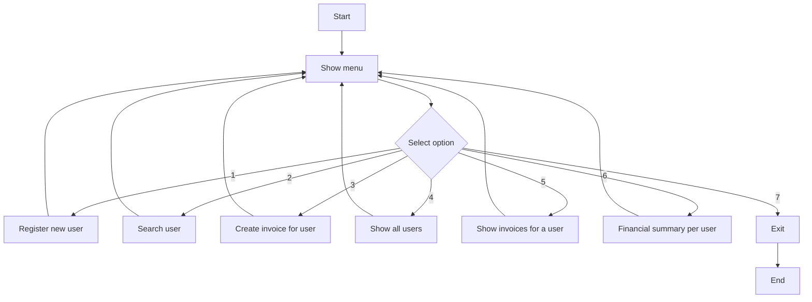

```mermaid
flowchart TD
  Start["Start"] --> Menu["Show menu"]
  Menu --> Choice{"Select option"}
  Choice -->|1| RegUser["Register new user"]
  Choice -->|2| SearchUser["Search user"]
  Choice -->|3| CreateInvoice["Create invoice for user"]
  Choice -->|4| ShowUsers["Show all users"]
  Choice -->|5| ShowInvoices["Show invoices for a user"]
  Choice -->|6| Summary["Financial summary per user"]
  Choice -->|7| Exit["Exit"]

  RegUser --> Menu
  SearchUser --> Menu
  CreateInvoice --> Menu
  ShowUsers --> Menu
  ShowInvoices --> Menu
  Summary --> Menu
  Exit --> End["End"]
```